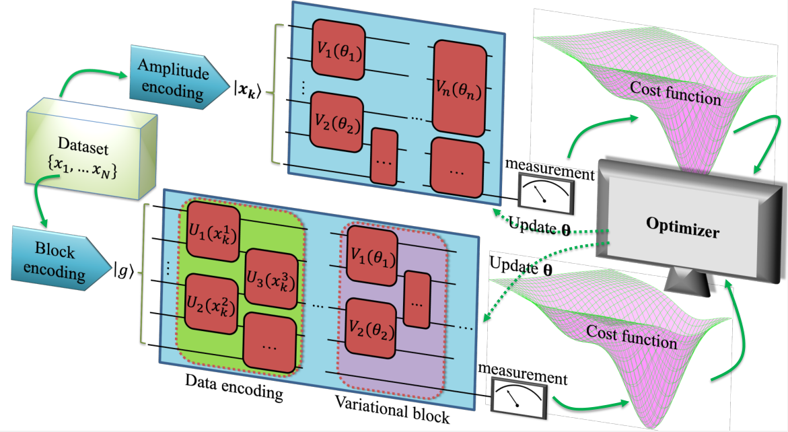

# Quantum Neural Network Classifiers

An implementation of quantum neural network (QNN) classifiers



## Download

```bash
$ git clone https://github.com/LWKJJONAK/Quantum_Neural_Network_Classifiers
```

The codes are mainly provided in jupyter notebook formats with intermediate results presented

## Contents

- [Amplitude-Encoding Based QNNs: Basic Building Blocks](amplitude_encode/amplitude_encoding_Sec_3.1.ipynb)
- [Amplitude-Encoding Based QNNs: An Example Code For The Whole Training Procedure](amplitude_encode/an_example_code_for_the_whole_training_procedure.ipynb)
- [Block-Encoding Based QNNs: An Example Code For The Whole Training Procedure](block_encode/block_encoding_Sec_4.1.ipynb)

## Data

In [Quantum Neural Network Classifiers: Codes, Brief Review, and Benchmarks](), we provide 5 Tables to exhibit the benchmarks. In addition to the average accuracy provided in this paper, in the complete data files, we also record the learning rate, the batch size, the number of iterations, the size of the training and test sets, and the accuracy/loss curves during the training process. The quick link is shown here: (the code for this part will not be updated, since in these links we have provided all the 55000 data files recording the numerical results)

- [Table 1: Different depths & Three digital entanglement layers](https://github.com/LWKJJONAK/Quantum_Neural_Network_Classifiers/tree/main/amplitude_encode/Benchmark_Table1)
- [Table 2: Different analog layers’ Hamiltonian evolution time & Depths 1, 3, 5](https://github.com/LWKJJONAK/Quantum_Neural_Network_Classifiers/tree/main/amplitude_encode/Benchmark_Table2)
- [Table 3: Different depths & Three analog entanglement layers](https://github.com/LWKJJONAK/Quantum_Neural_Network_Classifiers/tree/main/amplitude_encode/Benchmark_Table3)
- [Table 4: Different scaling factors for data encoding & Three digital entanglement layers](https://github.com/LWKJJONAK/Quantum_Neural_Network_Classifiers/tree/main/block_encode/Benchmark_Table4)
- [Table 5: Different analog layers’ Hamiltonian evolution time & Three scaling factors](https://github.com/LWKJJONAK/Quantum_Neural_Network_Classifiers/tree/main/block_encode/Benchmark_Table5)

## Motivation

Over the recent years, quantum neural network models have attracted a lot of attention and explorations. One major direction of QNNs is to handle classification tasks. Here, we divide QNN classifiers into two categories according to the ways of data encoding as exhibited in the figure above:

- The amplitude encoding strategy is suitable for the situations where we have a quantum random access memory (QRAM) to fetch the data, or the data directly comes from a quantum process (natural quantum data).
- The block encoding strategy is suitable for the situations where we have to encode the classical data into the QNN models.

## Environment

For the packages used in our simulations, there are multiple ways to install them.
For the first way, the list of packages we used can be found at [Project.toml](https://github.com/LWKJJONAK/Quantum_Neural_Network_Classifiers/blob/main/Project.toml) and the users can install them accordingly.
For example, if we want to install Yao.jl, simply type ] to enter the Package manager mode
and type "add Yao". Then the target package will be installed.

An alternative way for Linux users is shown as follows.
Julia's packages are installed at ~/.julia by default. So a convenient way to install the packages for our use is to download the two files ([Manifest.toml](https://github.com/LWKJJONAK/Quantum_Neural_Network_Classifiers/blob/main/Manifest.toml) and [Project.toml](https://github.com/LWKJJONAK/Quantum_Neural_Network_Classifiers/blob/main/Project.toml)) from this page, and put them at the folder .julia/environments/v1.7 (assuming we are using the version 1.7 of Julia). 
In the last step, typing ] to enter the Package manager mode,
typing "update" or "up" to update the packages and typing "build" will finish the installation.
In this way, we can install all the packages at once, while some of them may not be necessary.
For better coding experience, version 1.6 or higher of Julia is suggested.

Notice: the version Yao#v0.7.4 seems not very consistent with many functions, e.g., the YaoPlots cannot plot the analog quantum layers, and the density_matrix() cannot handle the BatchedArrayReg type.
Thus, it is suggested to use earlier versions such as Yao#v0.6.5. 
(When future versions fix these issues, I'll delete this notice)

## Built With

* [Yao](https://github.com/QuantumBFS/Yao.jl) - A framework for Quantum Algorithm Design

Detailed installation instructions and tutorials of Julia and Yao.jl can be found at [julialang.org](https://julialang.org/) and [yaoquantum.org](https://yaoquantum.org/), respectively.

Examples of using Yao in other projects
- [TensorNetwork Inspired Circuits](https://github.com/GiggleLiu/QuantumPEPS.jl)
- [QuAlgorithmZoo](https://github.com/QuantumBFS/QuAlgorithmZoo.jl/tree/master/examples)
- [QuODE](https://github.com/QuantumBFS/QuDiffEq.jl)

## To Cite
```bibtex
@unpublished{Li2022QuantumNeural,
    title={Quantum Neural Network Classifiers: A Pedagogical Tutorial},
    author={Li, Weikang and Lu, Zhide and Deng, Dong-Ling},
    year = {2022},
    eprint={TBD},
    eprinttype = {arxiv},
    archiveprefix = {arXiv}
}

@article{Luo2020Yao,
  title = {Yao.Jl: {{Extensible}}, {{Efficient Framework}} for {{Quantum Algorithm Design}}},
  author = {Luo, Xiu-Zhe and Liu, Jin-Guo and Zhang, Pan and Wang, Lei},
  year = {2020},
  journal = {Quantum},
  volume = {4},
  pages = {341},
  doi = {10.22331/q-2020-10-11-341},
  url = {https://quantum-journal.org/papers/q-2020-10-11-341/}
}
```
We experimentally implement the block-encoding based QNNs for large-scale (256-dimensional) real-life images' classifications, see also the paper "Experimental Quantum Adversarial Learning with Programmable Superconducting Qubits"
```bibtex
@unpublished{Ren2022Experimental,
  title = {Experimental Quantum Adversarial Learning with Programmable Superconducting Qubits},
  author = {Ren, Wenhui and Li, Weikang and Xu, Shibo and Wang, Ke and Jiang, Wenjie and Jin, Feitong and Zhu, Xuhao and Chen, Jiachen and Song, Zixuan and Zhang, Pengfei and Dong, Hang and Zhang, Xu and Deng, Jinfeng and Gao, Yu and Zhang, Chuanyu and Wu, Yaozu and Zhang, Bing and Guo, Qiujiang and Li, Hekang and Wang, Zhen and Biamonte, Jacob and Song, Chao and Deng, Dong-Ling and Wang, H.},
  year = {2022},
  eprint = {2204.01738},
  eprinttype = {arxiv},
  archiveprefix = {arXiv}
}
```

## License

Released under [GPL-3.0 License](https://github.com/LWKJJONAK/Quantum_Neural_Network_Classifiers/blob/main/LICENSE)
